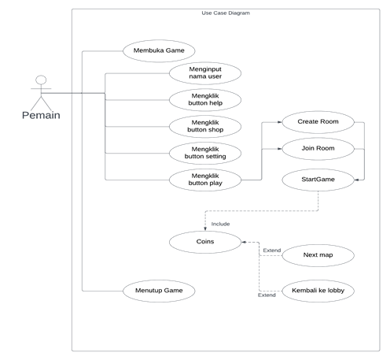
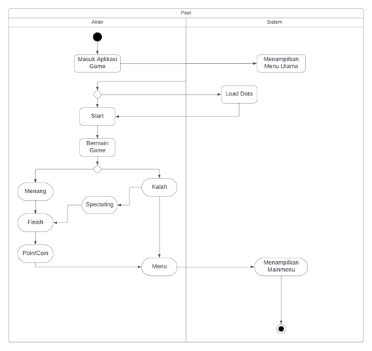
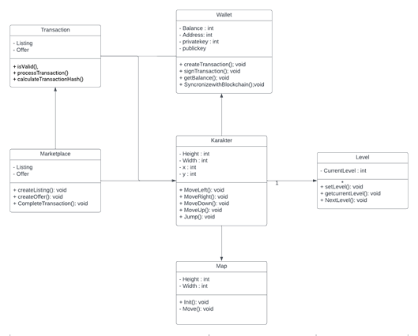
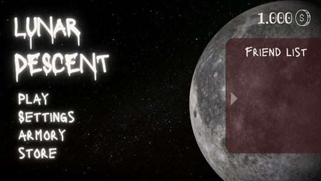
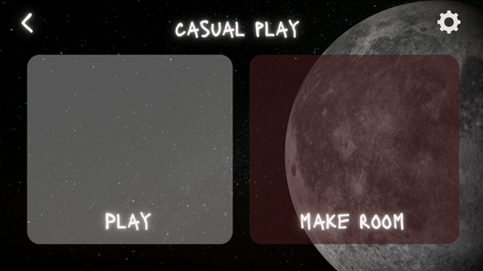
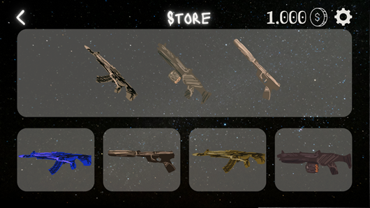
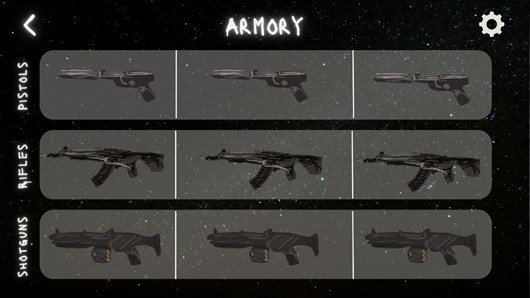
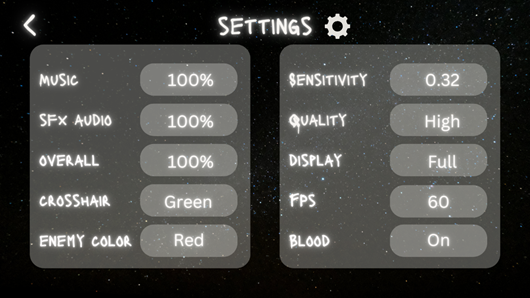
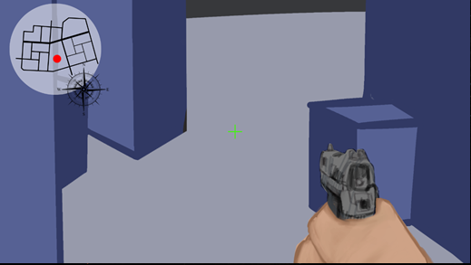

#LunarDescent
This is a project I developed myself for my Master's thesis, creating a multiplayer FPS game that implements blockchain technology for all transactions.

#LunarDescent — Game Design Document (GDD)

## 1. Game Overview

### 1.1 Concept
LunarDescent is a multiplayer first-person shooter (FPS) game based on blockchain technology. Players engage in intense battles against other players to achieve victory. Blockchain integration ensures security, transparency, and full ownership of in-game digital assets.

**Key Features:**
- Intense & competitive FPS combat
- Blockchain-based in-game economy (Ethereum + NFT)
- Social & community features
- Weapon and character customization

### 1.2 Genre
- Multiplayer FPS
- Blockchain-powered
- Competitive, fast-paced, skill-based action

### 1.3 Target Audience
- Multiplayer FPS players
- Blockchain & NFT enthusiasts
- Competitive marketplace (eSports) and casual gamers

### 1.4 Platform
- PC / Desktop (Windows, MacOS)
- 3D Graphics using Unity Engine

### 1.5 Visual Style
- Realistic and immersive
- High-quality graphics
- Futuristic theme with a cyberpunk touch

---

## 2. Gameplay

### 2.1 Game Modes
1. **Team Battle** – Team-based combat
2. **Free-for-All** – All players face each other
3. **Objective Missions** – Missions with objectives Specifics

### 2.2 Blockchain Integration
- **Platform:** Ethereum
- **Digital Assets:** NFTs (weapons, skins, accessories)
- **Ownership & Trading:** Players can buy and sell assets on the blockchain marketplace
- **Proof of Stake (PoS):** Real-time transaction validation

### 2.3 Game Economy
- Earn-to-Play: Players earn assets through gameplay
- Open Marketplace
- In-Game Tokens for transactions

### 2.4 Customization
- Upgrade weapons & character abilities
- Visual customization (skins, accessories)
- All progress is recorded on the blockchain

---

## 3. Core Game Loop
1. Enter the Game → Login / Create a Nickname
2. Select Mode → Team Battle / FFA / Objective
3. Fight → Collect points & assets
4. Earn Rewards → NFT / Token
5. Trade / Upgrade → Use or sell assets
6. Repeat → Improve skills & collections

---

## 4. Key Features
- Multiplayer FPS with real-time combat
- Decentralized Economy
- NFT Marketplace
- Blockchain-based Progression System
- Community & Tournaments

---

## 5. Use Case Diagram & Description

### 5.1 Use Case Diagram

### 5.2 Use Case Description
| No. | Use Case Name | Actor | Short Description |
|----|---------|-------|-------------------|
| 1 | Input Nickname | Player | Player enters the name to be used in the game |
| 2 | Play Game | Player | Starts a match |
| 3 | Shop | Player | Purchases in-game items or assets |
| 4 | Settings | Player | Adjusts controls, audio, and graphics |
| 5 | Help | Players | View tutorials and guides |
| 6 | Create Room | Players | Create a game room |
| 7 | Join Room | Players | Join a game room with a code |

Scenario details are in [`USECASE DETAIL](USECASEDIAGRAM.pdf)

---

## 6. Activity Diagram

---

## 7. Class Diagrams

**Main Class:**
- Wallet (Balance, Address, PrivateKey, PublicKey, CreateTransaction, SignTransaction, GetBalance, SyncWithBlockchain)
- Transactions
- Marketplace
- Folder
- Characters
- Levels

---

## 8. UI / Screen Design

### 8.1 Main Menu
- Menu: Play, Settings, Armory, Store
- Friend List panel
- Currency display

### 8.2 Room Screen
- Create Room & Join Room buttons
- Back button, Settings icon

### 8.3 Store
- Item list & preview
- Currency display
- Navigation arrows

### 8.4 Armory
- Weapon categories (Pistols, Rifles, Shotguns)
- Preview panels

### 8.5 Settings
- Audio settings
- Control sensitivity
- Graphics quality
- Crosshair & enemy colors

### 8.6 Gameplay
- First-person view
- Mini-map & compass
- HUD with ammo, health, and objectives

---

## 9. Improvement & Innovation
- Proof of Stake (PoS) for real-time transaction validation
- NFTs as tradable game assets
- System transparent and fair rewards

---
